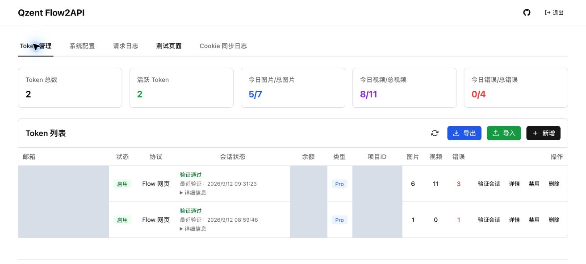
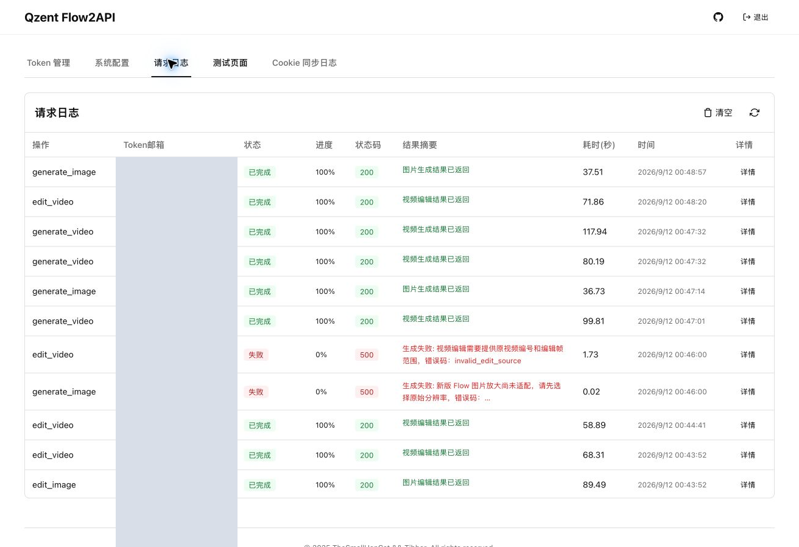
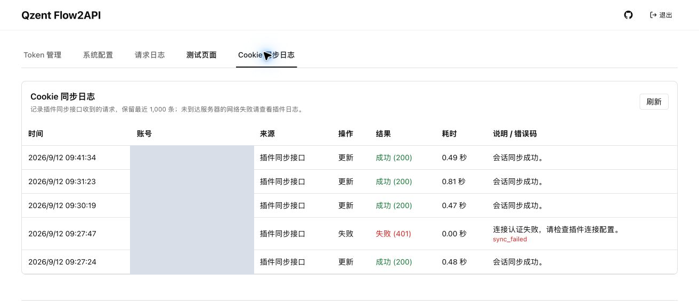

# Qzent Flow2API

[](LICENSE)

**qzent-flow2api** 是基于 [TheSmallHanCat/flow2api](https://github.com/TheSmallHanCat/flow2api) 的扩展分支，为 Google Flow 提供 OpenAI / Gemini 兼容接口及管理控制台。

保留上游 MIT 许可证及版权声明。本项目是社区维护的非官方接口适配，不隶属于 Google；使用能力受账号权限、可用积分和上游服务状态影响。

本仓库仅包含 Qzent Flow2API 服务端、管理控制台和测试，不包含产品端、账号管理工具或浏览器插件源码。保留服务端 Cookie 同步接口，可手动导入 Cookie 使用。API 路径、现有模型别名和容器服务名称保持兼容。

## 本分支增加的功能

- 适配 `flow.google.com` 网页会话，支持带域名的 Cookie JSON 导入和插件同步。
- 图片生成、参考图编辑、视频生成、视频上传及编辑。
- 视频素材与账号绑定：编辑必须使用源素材所属账号，不能随意切换账号。
- 会话验证、连接失败与需要更新 Cookie 分开显示。
- 请求日志区分生成与编辑，新日志可查看参考图片或源视频。
- Cookie 同步日志记录同步结果、耗时和错误码，不记录 Cookie 原文。
- API 返回中文处理建议，并保留可用的原始上游错误码。
- 首次未配置 API Key 时随机生成并保存，管理页可生成新密钥。

**支持范围、实测依据和限制见 [功能说明](docs/FEATURES.md)。**

## 快速安装

### Docker 源码部署

需要 Git、Docker 和 Docker Compose。默认 Compose 使用本分支源码构建，不拉取上游预构建镜像。

```bash
git clone https://github.com/qzent-ai/qzent-flow2api.git
cd qzent-flow2api
cp config/setting_example.toml config/setting.toml
chmod 600 config/setting.toml
```

**启动前编辑 `config/setting.toml`，将 `admin_password` 改为自己的强密码。** `api_key` 留空，首次启动时随机生成。示例管理员用户名为 `admin`。

```bash
docker compose up -d --build
docker compose logs --tail=100 flow2api
```

管理入口：`http://localhost:38000/manage`。首次登录后，到“系统配置”查看 API Key，再按 [Cookie 教程](docs/COOKIES.md) 添加账号。默认没有 Google 账号，空实例不能生成媒体。

配置和账号数据分别保存于 `config/setting.toml`、`data/flow.db`；生成缓存位于 `tmp/`。它们不会打入新版镜像，部署时通过卷挂载使用。首次初始化后部分配置以数据库为准，请在管理页修改，不能只修改 TOML 就认为已经生效。

### 本地 Python 部署

需要 Python **3.11 或以上版本**。

```bash
cp config/setting_example.toml config/setting.toml
chmod 600 config/setting.toml
python3 -m venv .venv
.venv/bin/pip install -r requirements.txt
# 启动前修改 config/setting.toml 中的管理员密码
.venv/bin/python main.py
```

本地默认入口：`http://localhost:8000/manage`。Windows 可使用 `.venv\Scripts\python.exe` 和 `.venv\Scripts\pip.exe`。

### 生成所需配置

1. 导入已经登录 Flow 的 Cookie JSON，确认账号与会话验证结果。
2. 在系统配置中配置新版网页模式支持的验证码服务。目前生成路径接受 YesCaptcha、CapMonster、EzCaptcha 或 CapSolver；仅导入 Cookie 并不代表已具备生成能力。
3. 根据服务器网络配置请求和媒体代理；需要服务端缓存结果时启用缓存，并将缓存基础地址设为调用者可访问的地址。
4. 到“测试页面”填写 API Key，分别验证图片生成、视频生成和编辑。上游请求可能消耗账号积分。

插件的“连接 Token”、服务的“API Key”和 Google Cookies 用途不同，不能互相替代。外部网络访问请使用自己的 HTTPS 反向代理，不要公开管理凭据或本地数据卷。

### 更新

```bash
git pull --ff-only
docker compose up -d --build
```

更新前备份私有配置和数据库；不要用上游镜像替换本分支。已有部署应保留自己的端口、网络和卷挂载配置。`docker-compose.headed.yml` 等其他形态保留用于兼容，不作为新版网页生成的默认安装路径。

## API

| 接口 | 用途 |
|---|---|
| `GET /health` | 服务健康检查 |
| `GET /v1/models`、`GET /v1/models/aliases` | 模型和别名查询 |
| `POST /v1/chat/completions` | OpenAI 兼容生成、编辑；支持流式和非流式 |
| `POST /v1/videos/uploads` | 上传视频，返回不透明 `media_id` |
| `/v1beta/models/{model}:generateContent` | Gemini 兼容生成 |
| `/v1beta/models/{model}:streamGenerateContent` | Gemini 兼容流式生成 |

API Key 通过 `Authorization: Bearer ...` 发送；Gemini 路径也支持 `x-goog-api-key`。下面的环境变量需由你在本地配置，不要把真实值提交到 Git。

```bash
curl "$FLOW2API_BASE_URL/v1/chat/completions" \
  -H "Authorization: Bearer $FLOW2API_API_KEY" \
  -H 'Content-Type: application/json' \
  -d '{"model":"gemini-3.1-flash-image-landscape","messages":[{"role":"user","content":"一只在窗边晒太阳的橘猫"}],"stream":false}'
```

视频编辑使用 `flow_edit`，在消息内容中以 `image_url.url` 传入 `edit://<media_id>?start_frame=0&end_frame=120`。帧范围按 30 fps 计算；`media_id` 使用生成或上传接口返回的原值，并保留它所属的账号。可直接使用管理控制台测试页的上传及编辑表单。

调用失败时同时保留中文信息、本地 `code` 和可用的 `upstream_code`，不要仅显示“生成失败”。不同兼容接口的响应包装存在差异，具体以该接口响应为准。

## 管理界面

实际部署截图；账号、余额和项目标识已遮挡。截图不代表实时状态或性能承诺。

### 账号与会话管理



### 请求日志



### Cookie 同步日志



## 开发与验证

```bash
.venv/bin/pip install pytest pytest-asyncio
.venv/bin/python -m pytest tests -q
node --test tests/ui/*.test.cjs
# 创建临时目录和本地 HTTP 服务，不调用 Google
RUN_CLEAN_INSTALL_TEST=1 .venv/bin/python -m pytest tests/test_clean_installation.py -q
# 需要 Docker；仅使用合成凭据检查镜像构建上下文
RUN_DOCKER_CONTEXT_TEST=1 .venv/bin/python -m pytest tests/test_release_container_context.py -q
```

浏览器 UI 冒烟脚本使用模拟接口，不等同于真实 Google 生成验证。首次部署需要配置自己的账号、验证码服务和网络。

## 安全与来源

- [安全说明](SECURITY.md)
- [MIT 许可证](LICENSE)，保留 `Copyright (c) 2025 TheSmallHanCat`。
- [上游项目](https://github.com/TheSmallHanCat/flow2api)
- [上游 Token Updater](https://github.com/TheSmallHanCat/Flow2API-Token-Updater)：旧版插件不应视为兼容新版网页会话，请使用经过适配的版本或手动导入。

本分支问题请提交至本仓库维护者，避免把 Qzent 扩展的问题直接归给上游。本仓库从服务端源码快照初始化，不携带内部仓库历史；来源见 [NOTICE](NOTICE)。
